# PORTFOLIO WEBSITE - A2T1

## **Links**  
  
  
Published portfolio website - [Link](https://tonylehuynh.netlify.app/)

GitHub portfolio website repository - [Link](https://github.com/tonylehuynh/Portfolio-Assignment_T1A2)

Presentation video - [Link](https://www.google.com)

## **Portfolio Website Description**

## *Purpose*

The purpose of this portfolio website is to provide a professional representation of myself as a web-developer. 

It is an online portfolio that provides information about myself, my interests, my skills as well as a portfolio of my professional work and projects.

The portfolio website is designed to be simple in order to display all the information about myself concisely.

## *Target Audience*

The target audinece of this portfolio website is for all potential recruiters and employers who are looking to work with a web-developer/IT professional. 

The employer will have the expectation of professionalim as well as a positive image and work ethic. 

They will also expect that I convey my skills and technical knowledge in regards to software-development.

The portfolio website will also be suitable for any clients or other web-developers looking to work with me. 

## *Tech Stack*

The tech stack that was used to code the portfolio website was through HTML and the styling was done through CSS. This was done on the program VS Code and the website was deployed through the platform Netlify. 

The following websites were used as part of the design process:

Figma (for the wireframes), Coolors (for the website color palette), Font Awesome (for the social links icons) and LucidChart (for the sitemap).

## *Sitemap*

This is the sitemap for the portfolio website.

On the Blog page, all the 5 blog posts link to the same Blog Example Post Page. This is because the blog posts are currently a placeholder. 

## *Screeenshots*

Below are screenshots of the portfolio website and it's pages.

### **Index Page**

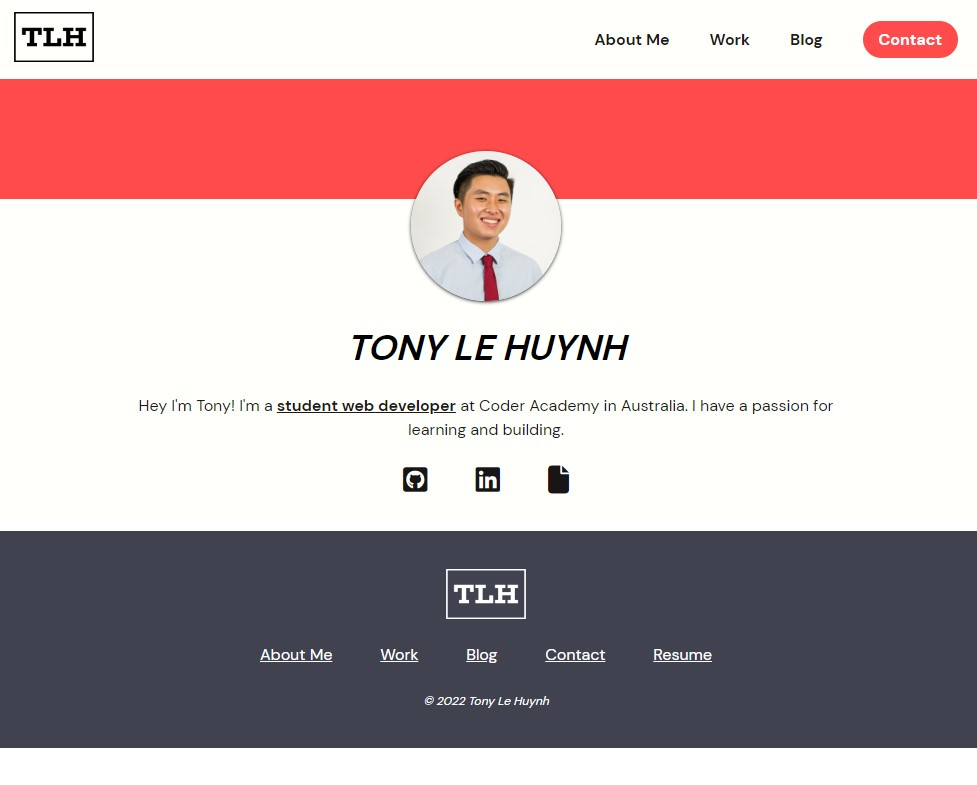

### **About Me Page**

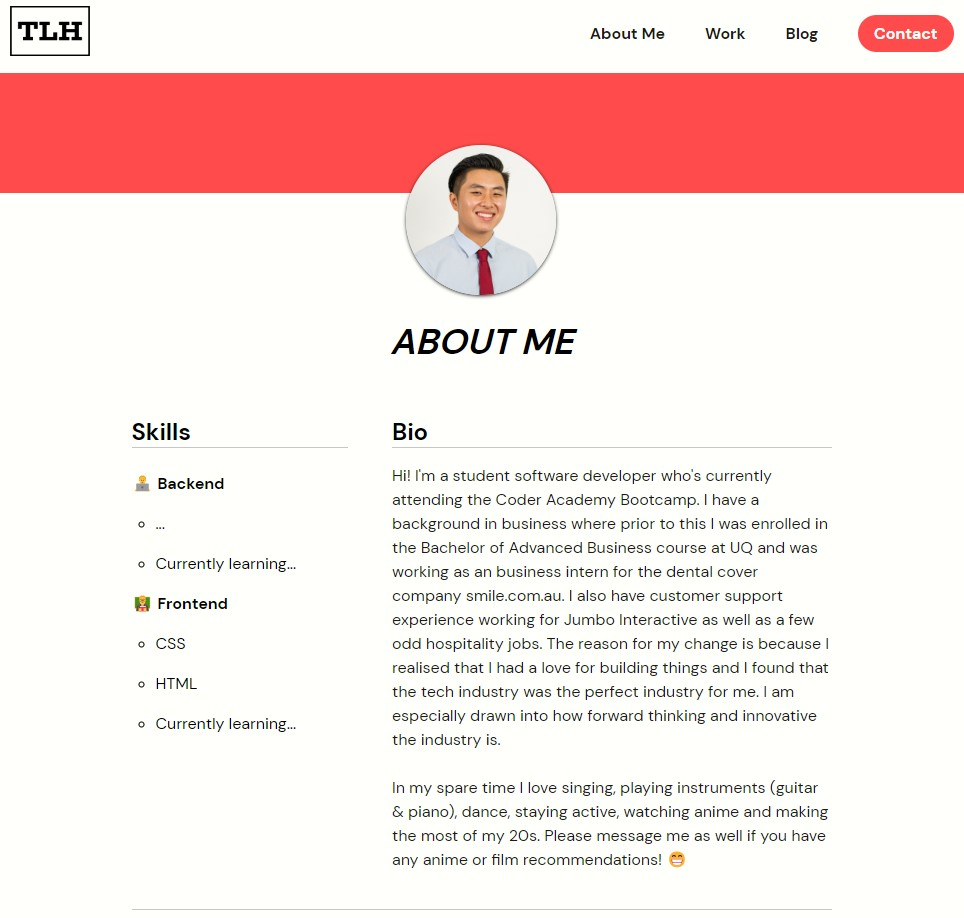

### **Work Page**

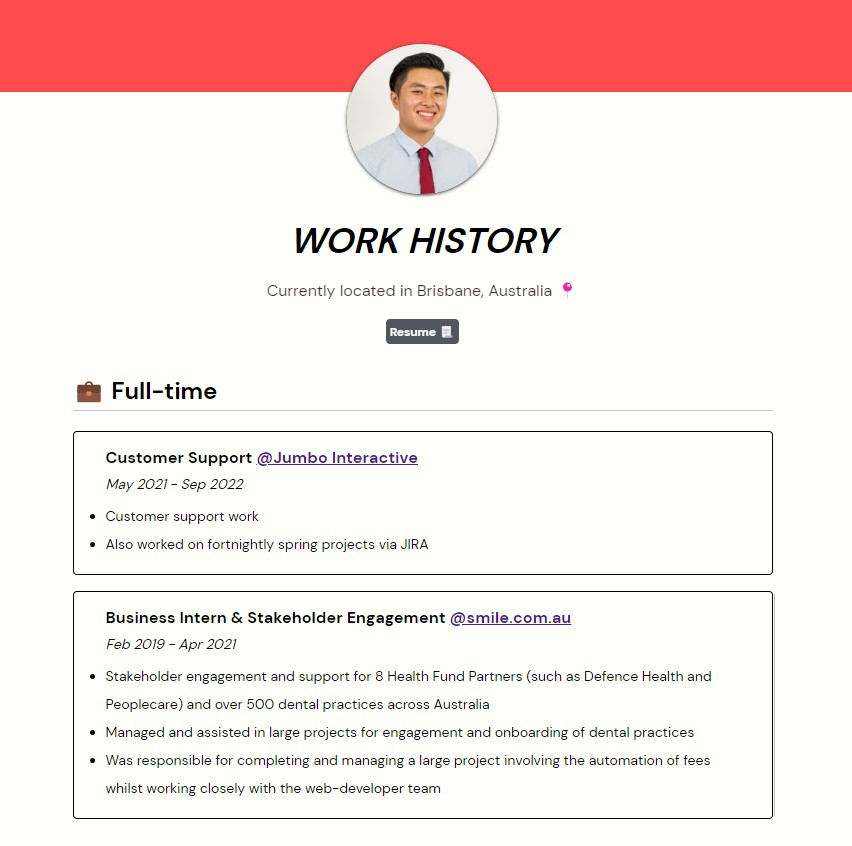

### **Blog Page**

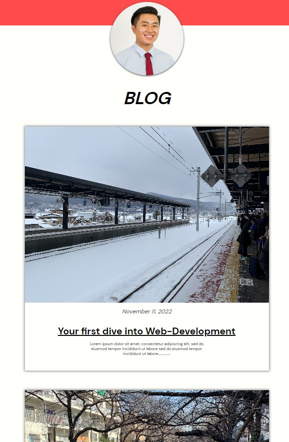

### **Contact Page**

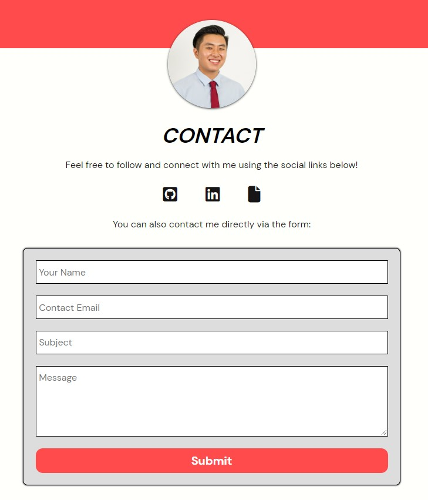

### **Blog Post Example**

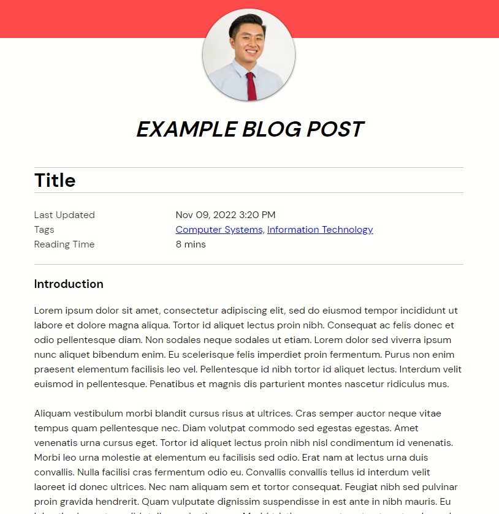

## *Functionality / Features*

Key features and functionality of the portfolio website include:

**Navigation bar**

This is designed to be very concise and allow for easy navigation.

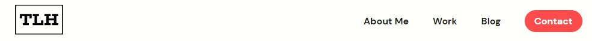

**Header**

To add color to the website as well as show a photo of myself with the page title.

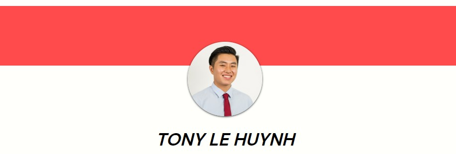

**Footer**

Easy navigation once user scrolls to the bottom.

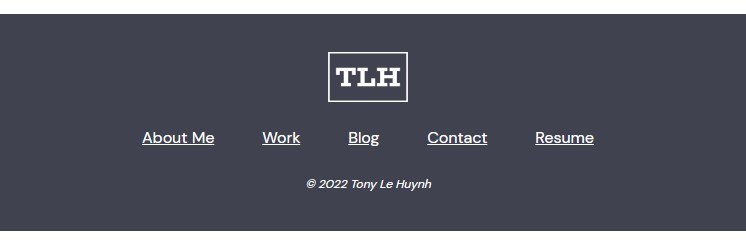

**Social links**

Icons which user can click to access my social pages such as LinkedIn

**Blog posts**

Blog posts which user can click and read

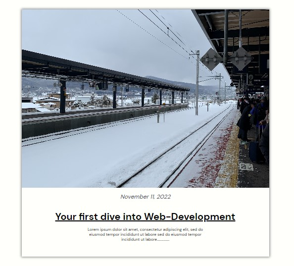

**Details**

A section to provide details for the blog post 

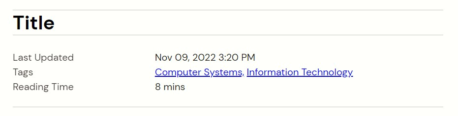

**Contact form**

Simple contact form for the user to use to contact me 

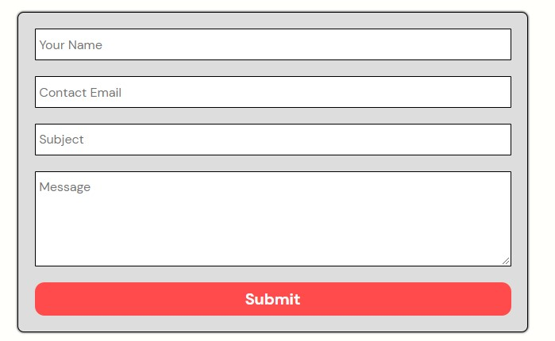

